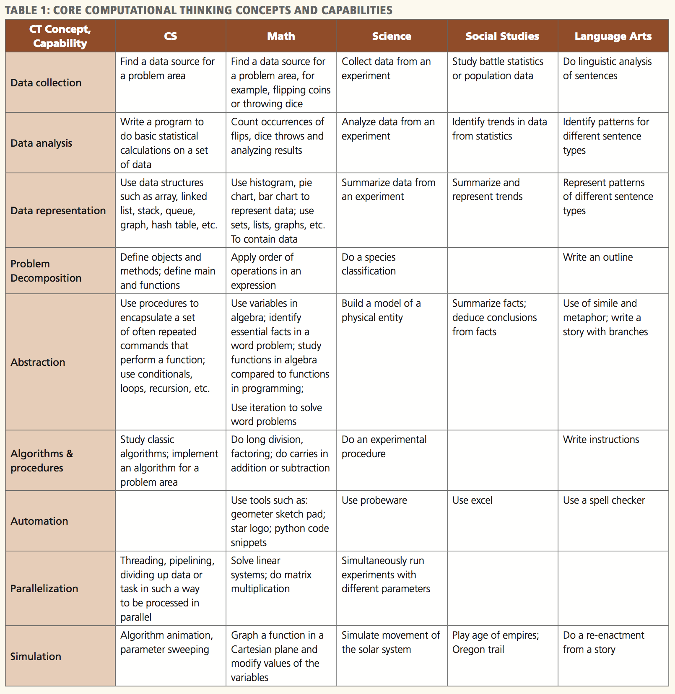
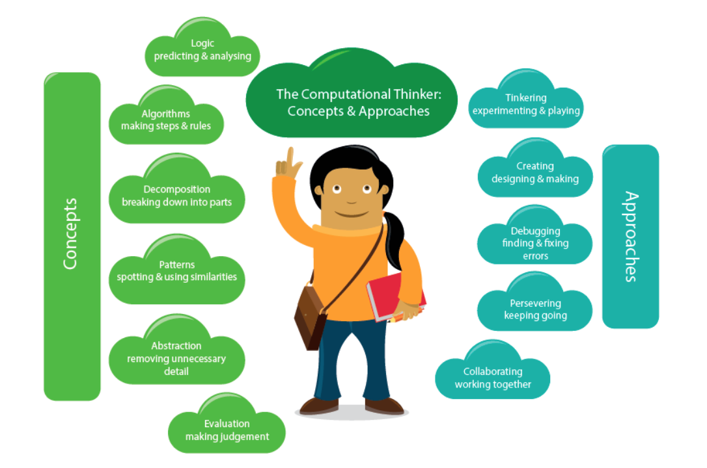
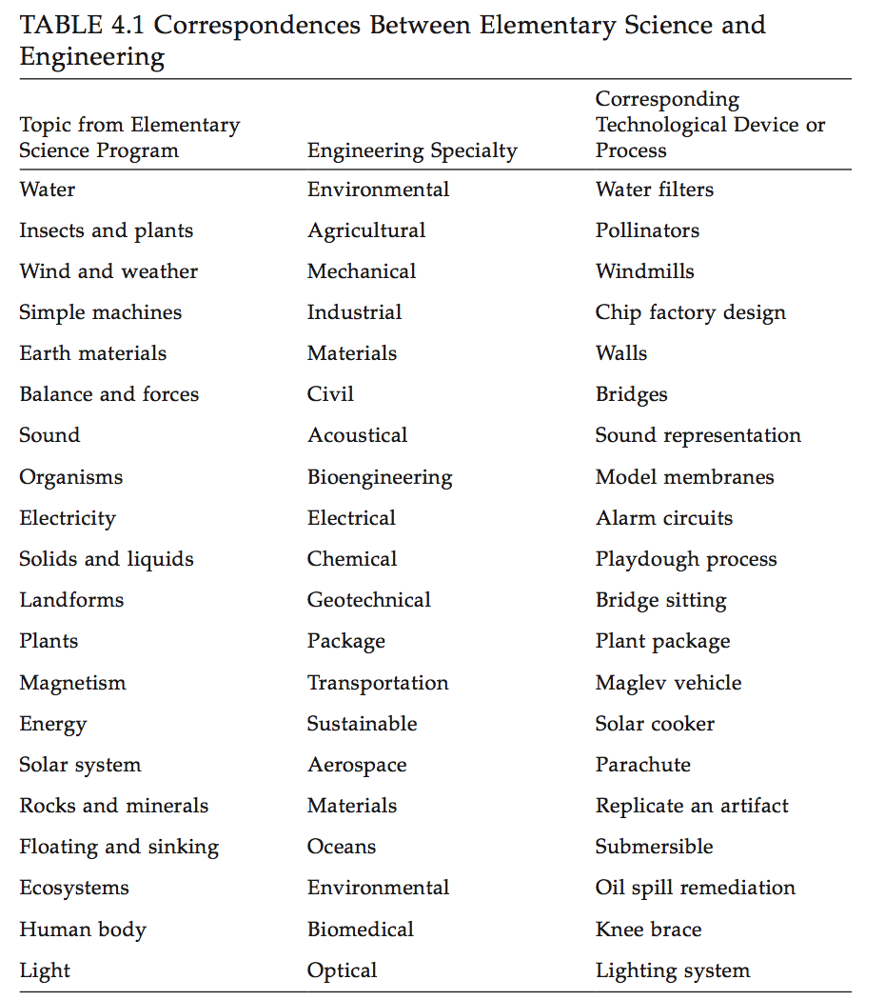

### Bringing Computational Thinking to K-12 (ACM, 2011)

[Available here.](https://c.ymcdn.com/sites/www.csteachers.org/resource/resmgr/BarrStephensonInroadsArticle.pdf)

Embedding computational thinking in K-12 requires a practical approach, grounded in an operational definition. It requires that we begin with a set of questions:

*   What would computational thinking look like in the classroom?
*   What are the skills that students would demonstrate?
*   What would a teacher need in order to put computational thinking into practice?
*   What are teachers already doing that could be modified and extended?

CT is an approach to solving problems in a way that can be implemented with a computer.

One structured model identified core computational thinking concepts and provided examples of how they might be embedded across multiple disciplines (see Table 1):

Strategies that could be beneficial to any learning experience included:

*   **Increased use of computational vocabulary** (by both teachers and students) to describe problems and solutions;
*   **Acceptance of failed solution attempts** (by both teachers and students), recognizing that early failure can often put you on the path to a successful outcome;
*   **Team work** by students, with explicit use of:
    *   _decomposition_ - breaking problems down into smaller parts that may be more easily solved,
    *   _abstraction_ - simplifying from the concrete to the general as solutions are developed,
    *   _negotiation_ - groups within the team working together to merge parts of the solution into the whole, and
    *   _consensus building_ - working to build group solidarity behind one idea or solution.

### Computational Thinking - A Digital Age Skill for Everyone (ISTE, 2011)

[Available here.](https://www.iste.org/docs/learning-and-leading-docs/march-2011-computational-thinking-ll386.pdf)

In a seminal article published in 2006, Jeanette Wing described computational thinking (CT) as a way of “_solving problems, designing systems, and understanding human behavior by drawing on the concepts fundamental to computer science._”

Computational thinking is a problem-solving process that includes:

*   Formulating problems in a way that enables us to use a computer and other tools to help solve them
*   Logically organizing and analyzing data
*   Representing data through abstractions (_such as models and simulations_)
*   Automating solutions through algorithmic thinking (_a series of ordered steps_)
*   Identifying, analyzing, and implementing multiple possible solutions (_to achieve the most efficient combination of steps and resources_)
*   Generalizing and transferring this problem-solving process to a wide variety of problems

### Computational thinking - a guide for teachers (Computing at School, 2015)

[Available here.](https://community.computingatschool.org.uk/resources/2324/single)

Computational thinking... is the process of:
*   recognising aspects of computation in the world that surrounds us and
*   applying tools and techniques from computing to understand and reason about natural, social and artificial systems and processes.

It embraces:
*   the ability to think algorithmically;
*   the ability to think in terms of decomposition;
*   the ability to think in generalisations, identifying and making use of patterns;
*   the ability to think in abstractions, choosing good representations; and
*   the ability to think in terms of evaluation.

**Logical reasoning**
*   analysing and checking facts
*   draw on their own knowledge to make and verify predictions, and to draw conclusions
*   test, debug, and correct algorithms
*   novel application of the other computational thinking concepts in order to solve problems

**Abstraction**
*   makes problems or systems easier to think about
*   the process of making an artefact more understandable by reducing unnecessary detail
*   choosing the right detail to hide so that the problem becomes easier, without losing anything that is important
*   choosing a good representation of a system (different representations make different things easy to do)

**Evaluation**
*   ensuring that a solution (whether an algorithm, system, or process) is fit for purpose
*   trade-offs need to be made, as there is rarely a single ideal solution for all situations
*   criteria, heuristics and user needs enable judgements to be made systematically

**Algorithmic thinking**
*   getting to a solution through a clear definition of the steps
*   the ability to think in terms of sequences and rules as a way of solving problems
*   kicks in when similar problems have to be solved over and over again, such that:
    *   they do not have to be thought through anew every time
    *   a solution that works every time is needed

**Decomposition**
*   thinking about artefacts in terms of their component parts, such that the parts can then be understood, solved, developed and evaluated separately
*   Through decomposition of the original task, each part can be developed and integrated later in the process

**Generalisation**
*   identifying patterns, similarities and connections, and exploiting those features
*   quickly solving new problems based on previous solutions to problems
*   asking “Is this similar to a problem I’ve already solved?” and “How is it different?”

**Note:** _aside from the list above and chart below, p. 14-15 include “distinct learner behaviours that may be observed in the classroom” from “each of the concepts of computational thinking described above”; they’re elided here for brevity._

### Computational Thinking in K−12 - A Review of the State of the Field (Educational Researcher, 2013)

`Paywalled. >|`

The idea of **“low floor, high ceiling”**:
*   it should be easy for a beginner to cross the threshold to create working programs (low floor),
*   the tool should also be powerful and extensive enough to satisfy the needs of advanced programmers (high ceiling).

Popular introductory computational experiences include:
*   _graphical programming environments_ such as Scratch, Alice, Game Maker, Kodu, and Greenfoot;
    * _Scratch_ lacks the means to abstract functionality into functions and procedures, prompting a version called _Snap!_ from Berkeley that seeks to address this.
*   _Web-based simulation authoring tools_ such as Agentsheets and Agentcubes; and
*   _robotics kits and tangible media_ such as Arduino and Gogo Boards
    * _Lilypad Arduino_ allow(s) children to combine traditional arts and crafts such as sewing and sketching with computation and electronics.

Several of these introductory computational experiences use the three-stage **“use–modify–create” progression** to help the learner go from user to modifier to creator of computational artifacts (Lee et al., 2011)

Video gaming as a platform for examining computational thinking among children has been underutilized in recent research.
* Holbert and Wilensky (2011) developed and tested a prototype video game, _FormulaT,_ aimed to serve as a platform for learning principles of kinematics as well as “systematic computational strategies.”
*   FormulaT used _NetLogo_, a computational environment for agent-based modeling.
*   The activities of abstracting pertinent behaviors into agents, applying rules, and evaluating the results via modeling and simulation are key ways of engaging in CT.
*   **Agent-based modeling,** however, remains relatively underused in CT research.

Other avenues of research include: 
*   recent research on human understanding of computing and how children explain their approaches to problem solving (Pane, Ratanamahatana, & Myers, 2001; Simon, Chen, Lewandowski, McCartney, & Sanders, 2007).
*   Fields, Searle, Kafai, and Min (2012) evaluated students’ engineering and programming skills as they debugged prebuilt faulty e-textile projects.
*   The development in the student use of the vocabulary and language of CS over the course of engaging in computationally rich activities provides an additional instrument for measuring the growth of CT (Grover, 2011).

### Computational Thinking Leadership Toolkit (CSTA,ISTE,NSF, 2011)

p. 14-15 include a fairly comprehensive chart of examples of progression across age tiers for nine CT skills. [Elided here for brevity.](http://www.iste.org/docs/ct-documents/ct-leadershipt-toolkit.pdf)

Focuses mostly on implementation strategies for  “CT thought leaders and change agents” `<vomits internally>`, but includes a potentially useful list of “Relevant Professional Development” and “Access to a Learning Community for Ongoing Support” on p. 23.

### Computational Thinking Teacher Resources (CSTA,ISTE,NSF, 2011)

Some duplication from the Leadership Toolkit, but majority of document is composed of nine [“prototypes for what CT can look like at various grade levels and content areas.”](https://c.ymcdn.com/sites/www.csteachers.org/resource/resmgr/472.11CTTeacherResources_2ed.pdf) Interesting to read through, but didn’t inspire many ideas on my end.

### Creative Computing - Guide (Harvard GSE, 2014)

[“This guide is a collection of ideas, strategies, and activities for an introductory creative computing experience using the Scratch programming language.”](http://scratched.gse.harvard.edu/guide/files/CreativeComputing20141015.pdf)

*   includes computational thinking concepts (sequence, loops, parallelism, events, conditionals, operators, data)
*   “Who is this guide for?” 
    * Lists “Teacher, Museum/Library Educator, Parent, College Instructor, Young Learner” 
    * Then: explains how Scratch can be meaningful to each of them. 
    * These guys get it.
*   Inspired by constructionist approaches to learning:
    *   _Creating_: Offer opportunities for learners to engage in designing and making, not just listening, observing, and using.
    *   _Personalizing_: Offer opportunities for learners to engage in activities that are personally meaningful and relevant.
    *   _Sharing_: Offer opportunities for learners to engage in interactions with others as audience, coaches, and co-creators.
    *   _Reflecting_: Offer opportunities for learners to review and rethink their creative practices.

*   In terms of content and organization, there’s plenty one should steal from their demos.

### Creative Computing - Learner Workbook (Harvard GSE, 2014)

[Awesome, awesome, awesome 110+ page learner workbook as intro-to-Scratch.](http://scratched.gse.harvard.edu/guide/files/CreativeComputing20140820_LearnerWorkbook.pdf) 

So many cool design strategies applied here. Plenty one should steal. 

Would boost the image/graphics-to-words ratio for Code Kitty, though -- I like the idea of the integrated comic book.

### International CS Education Standards (Google for Education, nd)

[Available here.](https://docs.google.com/spreadsheets/d/1SE7hGK5CkOlAf6oEnqk0DPr8OOSdyGZmRnROhr0XHys/edit#gid=218360034)

Comprehensive, and accessible: if a bit overwhelming. One could do worse than simply building curriculum to match each standard in column D.

### Report of a Workshop on the Pedagogical Aspects of Computational Thinking (National Academies Press, 2011)

[Available with free NAP account here.](https://www.nap.edu/catalog/13170/report-of-a-workshop-on-the-pedagogical-aspects-of-computational-thinking)

*   help students break a big problem into smaller problems and let the computer do the small parts—a process that helps to empower students.
*   An overarching theme in this time frame might be the lesson that learning is cumulative—a student can learn more by building on something he or she already knows.
*   find ways to make individual students class “experts” on troubleshooting the operating system or accessing online materials to take advantage of available technical skills
*   What cool stuff could one do w/ building the materials below w/ common items? (Could integrate more at interdisciplinary sciences...)

*   ...although young children can do fundamental experimental design, they often close their inquiry prematurely. 
    * For example, if young learners are asked, “If we want to find out if the mouse that’s eating my cheese is big or small, which trap should we use?” and then are offered the options of a small-door trap or a big-door trap, the students can often understand that the small trap is going to be informative whereas the large door is not. But, if they are asked, “If we use a big door on the mouse trap, can we say whether the mouse is big or small?,” they tend to say, “Yes, that means the mouse must be big.” 
    * Premature closure also sometimes occurs when children are presented with confirming evidence. Children often stop the inquiry at this point, not realizing that the inquiry remains unfinished and that confirming evidence is not sufficient to rule out competing hypotheses.