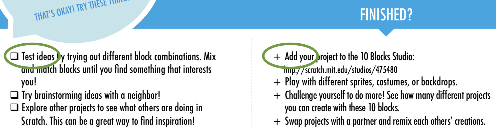

## What Are We Doing Here?

Back in the summer of 2017, I participated in the [Twin Cities Startup Weekend Education](http://communities.techstars.com/usa/twincities/startup-weekend/10569); I still get a smile every time I dip by the site of [the team I helped with!](http://codekitty.org/)

I moved on after a few months (_I was more interested in the original pitch of conducting in-service teacher-training sessions, rather than direct-to-K-6 workshops; simultaneously, my own job started up a more-demanding greenfield project_), but during my time there I did undertake a review of the literature around computational-thinking (_henceforth "CT"_) skills.

One goal I have for this blog is to prompt cyclical returns to previous work, after an arbitrary time of reflection and personal maturation. I plan for each post to end with a "_so what, now what?_" list of next steps: a prompt I could return to, several weeks or months down the road, with [fresh eyes, greater skills, perhaps even a freer schedule].

The first three-dozen or so `Notes` posts (_the ones I'd ported over by Markdownifying old gDrive notes, to first populate this blog_), however, lack that challenge to my future self: that's what I'm aiming for these "_Revisitation_" posts to produce.

## First Takeaway: Overlapping Taxonomies

My first thought on perusing these articles, again, was of [XKCD’s take on standards;](https://xkcd.com/927/) my second, an uneasy memory of aligning [ACTFL](https://www.actfl.org/publications/guidelines-and-manuals/actfl-performance-descriptors-language-learners) tables to the original [CEFR](https://rm.coe.int/CoERMPublicCommonSearchServices/DisplayDCTMContent?documentId=090000168045bb52) descriptors to [ALTE's](https://www.cambridgeenglish.org/Images/28906-alte-can-do-document.pdf) implementation thereof to [ILR](http://www.govtilr.org/Skills/ILRscale1.htm) lists to...

It seems healthy, at such an initial stage, for \${_frameworks of describing and assessing CT_} to proliferate; and I am too removed from the field to perceive whether whether they might inform, compete, or even merge with each other.

My worry, though, is that they’ll do none of those, but instead (_like language proficiency metrics!_) maintain largely geographically- and institutionally-decided realms of influence, thereby siloing research and practice.

I found [Google’s initial work](https://docs.google.com/spreadsheets/d/1SE7hGK5CkOlAf6oEnqk0DPr8OOSdyGZmRnROhr0XHys/edit#gid=218360034) done to compare computer science standards across countries to be a heartening guide; less so the facts that

1. no work appears to have been done on the document in the intervening year and a half since I first encountered it, and
1. it's kept in the presentationally-unprofessional Google Sheets (_though I suppose, somewhat amusingly, it **is** their product. Drink your own champagne, and all that._)

On revisitation, though, what strikes me about that site most of all is the incapacity of a two-dimensional table to organize and display all the information I'd want, even for a subset of the information provided (in this case, any record where the value for the `Strand` field is `Computational Thinking`.)

**So what, now what?**

The next-step challenge to myself, then — the product to build or idea to research — would be a codebase to visualize how pre-existing CT standards overlap (_or do not._)

(_I’m leaving aside, for now, the fact that such a comparison would actually need to be undertaken, prior. That itself could be a pleasant first step, and — assuming that academic rigor isn’t a goal — a fairly low-key, nondemanding one._)

Could each standard be a `key:value` store mapped to a node, which then themselves would be organized on a three-dimensional graph along with the axes of e.g. student age, standards provider, and generic subskill type? Or should a different piece of data map to a node?

When accessed, how would the data in those (_presumably_) JSON blobs be displayed? What data would they be required to contain, and what would be optional — descriptions of implementation? Links to third-party lesson plans and classroom artifacts?

## Second Takeaway: Lesson Plans and New Media

Contrasted with those of the other white papers and conference proceedings, my notes on the [teacher- and learner-focused PDFs from ScratchEd](http://scratched.gse.harvard.edu/guide/download.html) were startlingly brief, and effusive. And on review of those workbooks and guides? I'd say it’s still justified.

Reading through those documents is an actual joy: each of the three times I’ve passed through these two documents this week, I come across new design decisions that I’d like to adapt myself, for future projects:

=> \${sth: how similar to TEFL textbook scaffolding? how similar to Prime classroom activities? what students might it have trouble reaching?}

=> \${sth else: how similar to TEFL textbook scaffolding? how similar to Prime classroom activities? what students might it have trouble reaching?}

Even when it's something I don't necessarily like, I find myself thinking through \${design choises I'd not considered prior} more carefully: and that's a real gift.

As an example, the docs' common use of ${the square commonly used to denote checkboxes} to serve as${what could either be an interactive checkbox, or a read-only bulletpoint} is confusing:

To me, this unclear use of a visual cue (_"squares with box shadow ask for the text following them to be \${read, then either affirmed or enacted}, then the square itself is checked off in order to confirm the completion of that interaction with the text"_) is compounded by

1. their parallel use of crosses to serve a possibly-identical function (_see above image; throughout the text, I was unable to locate a description of the reasoning behind when one would be used over the other — though I noticed this symbol-overlap appears to be rectified [in the V3 previews](http://scratched.gse.harvard.edu/resources/sneak-peek-third-edition-creative-computing-curriculum-guide)_), and
1. the absence of instructions for when, specifically, to check off a box, e.g. `Mix and match blocks in at least three different combinations` instead of `Mix and match blocks in various ways` (_though — if properly highlighted to the reader/teacher — this may actually be a feature, as it allows the instructor to tailor each step, ad lib, to the constraints of their classroom/learning context, e.g. choosing whether it would be at least "two different combinations" or "three" depending on how much time remained in the lesson._)

=> Still, constricted by being static sheaves of paper, essentially digital versions of a centuries-old medium. Could text be changed into web app - into interactive, click-through guide w/ tooltips, hover, animations, etc.

=> Thinking of my former students' technological affordances (what devices they had at home) - for ELL parents working w/ their kids - mobile instructions for parent, keyboard for kids?

**So what, now what?**

=> digital, interactive version of the pdf's, one app each for teacher and for learner (perhaps latter configurable by the former?)
