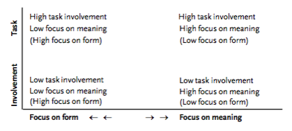

### The task-based approach: some questions and suggestions (Littlewood, 2004)

[Available here.](http://www.lenguasvivas.org/campus/files/0_28/tbl.pdf)

*   Skehan describes task-based learning (p. 294) as partly a reaction to the ‘outmoded’ view that any aspect of language can be presented to ‘the entire group of learners’ in a class.
*   Ellis is one of several writers who adopt the term ‘exercise’ for any activity in which the learners have no communicative purpose. Thus Ellis’s ‘exercises’ (in contrast to ‘tasks’) would correspond to Estaire and Zanon’s ‘enabling tasks’ (in contrast to ‘communication tasks’).
*   There are two dimensions that are crucial to understanding tasks.

*   The first dimension is **the continuum from \[focus on language forms\] to \[focus on the meaning that is communicated\]**
    *   _Non-communicative learning:_ Focusing on the structures of language, how they are formed and what they mean, e.g. substitution exercises, ‘discovery’ and awareness-raising activities, uncontextualized grammar exercises, substitution drills, and pronunciation drills
    *   _Pre-communicative language practice:_ Practising language with some attention to meaning but not communicating new messages to others, e.g. ‘question-and- answer’ practice wherein the teacher asks questions to which everyone knows the answer (‘Who is sitting next to John?’) but the student cannot answer without paying attention to the meaning of the words
    *   _Communicative language practice:_ Practising pre-taught language in a context where it communicates new information, e.g. information-gap activities or ‘personalized’ questions
    *   _Structured communication:_ Using language to communicate in situations which elicit pre-learnt language, but with some unpredictability, e.g. structured role-play and simple problem-solving
    *   _Authentic communication:_ Using language to communicate in situations where the meanings are unpredictable, e.g. creative role-play, more complex problem-solving and discussion

*   The second is the **degree of learner-involvement that a task elicits.**
    *   This dimension is unproblematic in the sense that we know we should aim at as high a level of task involvement as possible. 
    *   However... it becomes a major challenge as soon as we try to achieve that in a heterogeneous classroom.
    
    *   ...more exact to say that they are _properties of the learners as they engage in the tasks._ 
    * For example, even though a teacher may plan and conduct a communicative language practice task with the intention of stimulating learners to work with a balanced focus on form and meaning (centre top in the diagram)...
        *   some learners may focus almost entirely on the forms they are attempting to produce (top left),
        *   whilst others may focus entirely on getting their meanings across (top right)...
        *   \[and\] Some learners may lack involvement altogether...

*   ...task-based learning can be seen as a development within the communicative approach: the higher focus-on-meaning categories (_structured and authentic communication activities_)... come to serve not only as major components of the methodology but also as units around which a course may be organized. 
* These units provide a link between outside-classroom reality and inside-classroom pedagogy.
    *   At the interface with outside-classroom reality, communication tasks enable the course to be organized around ‘chunks of communication’ which reflect students’ needs, interests, and experiences.
    *   At the interface with inside-classroom pedagogy, they provide an organizing focus for the individual components of language (structures, vocabulary, and so on) that students have to learn in order to communicate.

*   the main common denominator of communicative and task-based approaches in their various forms is that, even when they use form-focused procedures, they are always oriented towards communication...

* * *

### Communicative Language Teaching Today (Richards, 2006)

[Available here.](https://www.professorjackrichards.com/wp-content/uploads/Richards-Communicative-Language.pdf)

TBI rejects (_the P-P-P_) model on the basis that
   1. it doesn’t work; and 
   2. it doesn’t reflect current understanding of second language acquisition: students do not develop fluency or progress in their grammatical development through a P-P-P methodology.

With TBI the focus shifts to using tasks
   1. to first create interaction, and then 
   2. to build language awareness and language development around task performance.

...key characteristics of a **task** are the following:
*   It is something that learners do or carry out using their existing language resources.
*   It has an outcome which is not simply linked to learning language, though language acquisition may occur as the learner carries out the task.
*   It involves a focus on meaning.
*   In the case of tasks involving two or more learners, it calls upon the learners’ use ofcommunication strategies and interactional skills.

Two kinds of task.
*   _Pedagogical tasks_
    *   require the use of specific interactional strategies
    *   may also require the use of specific types of language (skills, grammar, vocabulary)
    *   not something one would normally encounter in the real world; however, the interactional processes it requires provides useful input to language development.
*   _Real-world tasks_
    *   reflect real-world uses of language
    *   might be considered a rehearsal for real-world tasks

Willis (1996) proposes **six types of tasks:** 
   1. _Listing:_ make a list
   2. _Sorting and ordering:_ rank preexisting (or imagined) items
   3. _Comparing:_ find similarities/differences
   4. _Problem-solving:_ suggest/analyze solutions
   5. _Sharing personal experience:_ discuss reactions or narratives
   6. _Creative tasks:_ prepare plans or texts

Willis proposes the following **sequence of activities:**

1.  Pretask Activities: Introduction to Topic and Task
    1.  T helps Ss to understand the theme and objectives of the task
    2.  T may highlight useful words and phrases, but would not pre-teach new structures.
    3.  Ss can be given preparation time to think about how to do the task.
    4.  Ss can view a sample of the task being done.

2.  Task Cycle: Task
    1.  The task is done by Ss (in pairs or groups) and gives Ss a chance to use whatever language they already have.
    2.  The emphasis is on spontaneous, exploratory talk and confidence building.

3.  Task Cycle: Planning
    1.  Ss are asked to report briefly to the whole class:
        1.  how they did the task and
        2.  what the outcome was.
    2.  Ss draft and rehearse what they want to say or write; emphasis is on clarity, organization, and accuracy.
    3.  Individual students take this chance to ask questions about specific language items.

4.  Task Cycle: Report
    1.  T asks some pairs to report briefly.
    2.  There must be a purpose for others to listen.
    3.  No overt public correction.

5.  Language Focus: Analysis
    1.  T sets language-focused tasks, based on analyzing texts and extracting new language
    2.  T then reviews the Ss’ analysis, possibly boarding new/relevant language

6.  Language Focus: Practice
    1.  T conducts controlled-practice activities (pedagogical tasks or even more form-focused)
    2.  Emphasis on using samples from texts used in “Language Focus: Analysis” section

However...
*   There is little evidence that it works any more effectively than the P-P-P approach.
*   Task work may well serve to develop fluency at the expense of accuracy.
*   TBI addresses classroom processes rather than learning outcomes: where specific language needs have to be addressed (rather than general communication skills), TBI may be too vague.

* * *